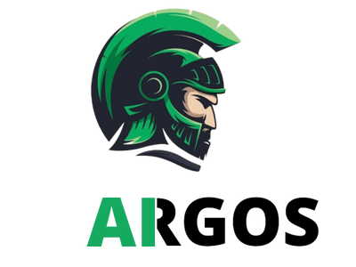
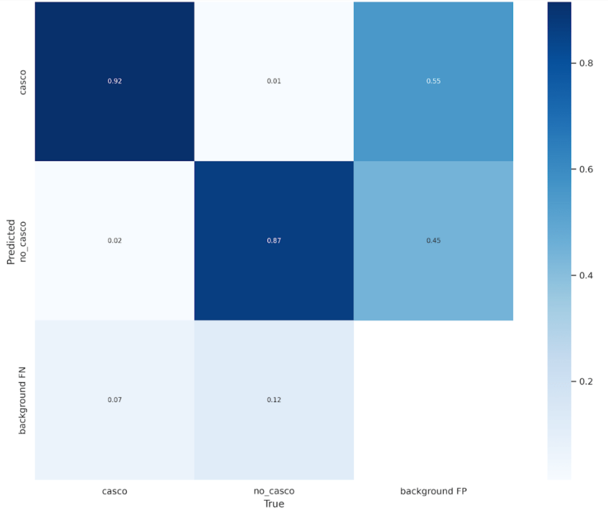
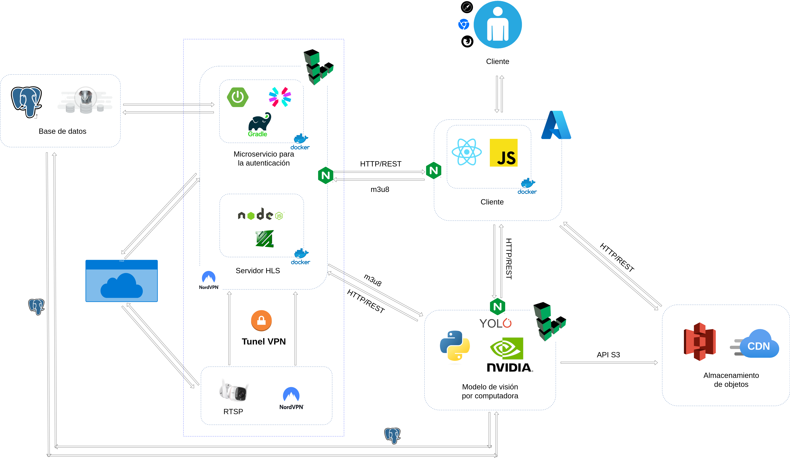
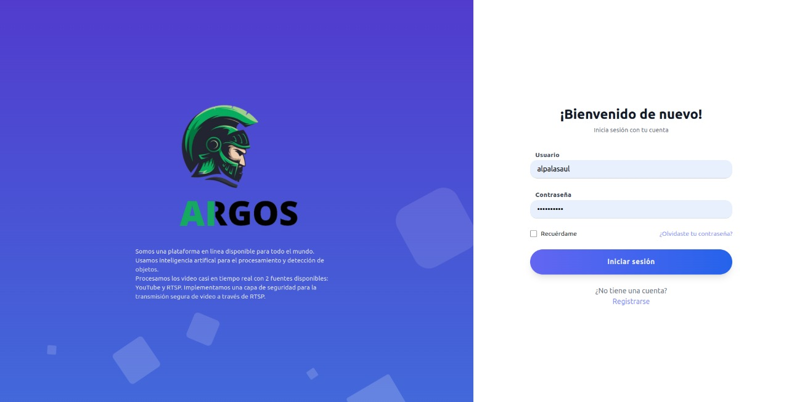
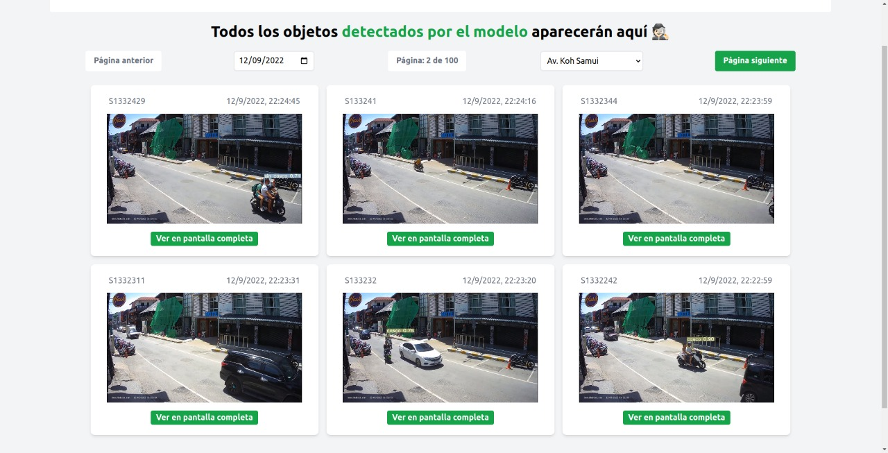
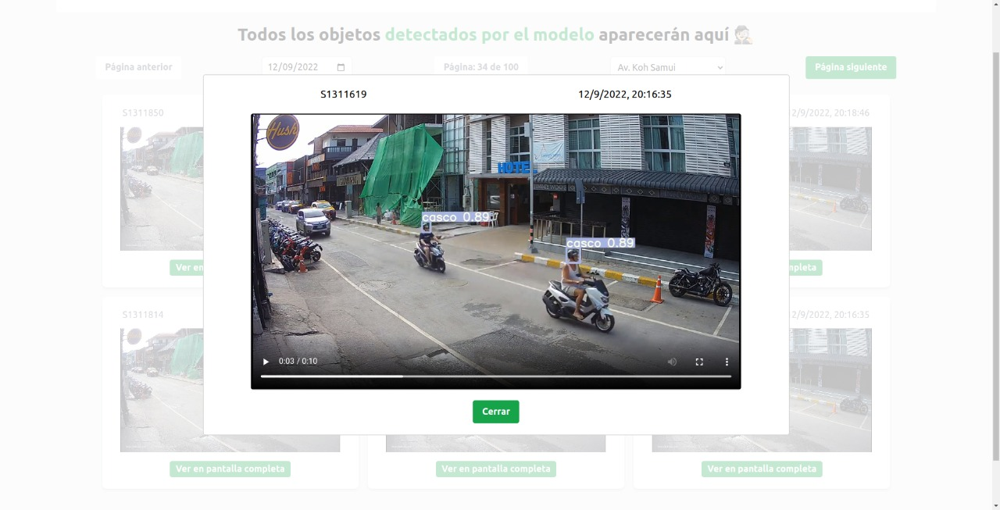

<h1>ARGOS</h1>

 

 

#### El presente repositorio corresponde al backend del proyecto de deep learning para la materia de **Minería de Datos** - [UCE](https://siiu.uce.edu.ec/)

## Contenido
- [Objetivo](#objetivo)
- [Estructura General](#estructura)
- [Métricas de los modelos IA](#Métricas de los modelos IA)
- [Arquitectura](#arquitectura)
- [Ejemplo en la implementación](#ejemplos)

## Objetivo

El proyecto está orientado en la construcción de un sistema que permita detectar motociclistas sin casco, de esta manera
se extrae fragmentos de videos con dicha evidencia, además, de estadísticas que representan las horas y las cámaras
con mayor afluencia de motorizados que inclumplan con esta normativa. Los pesos del mdoelo no son almancenados en
este repositorio, si desea más información contactar con nosostros.

## Estructura General

Para realizar el proyecto implica la manipulación de un modelo pre-entrenado, en este caso correspondiente a
[YOLO V7](https://github.com/WongKinYiu/yolov7) y con un dataset con alrededor de 1200 imágenes etiquetadas
usando la herramienta de [Roboflow](https://roboflow.com/). Las épocas usadas para el entrenamiento fueron de 100. 
Para más detalle ir a la sección de [Arquitectura](#arquitectura)

Se debe de considerar que la implementación es con YOLO, pero comparamos con varios modelos para seleccionar el adecuado,
uno de ellos consiste en uno realizado desde el inicio con Tensorflow.

A contunuación las herrameintas completas usadas:
* Java 11
* Maven
* JWT
* JavaScript
* Docker
* Nginx
* Amazon S3
* CDN Cloudfront
* VPN
* YOLOv7
* Python
* PostgreSQL
* Roboflow
* YOLO v7
* Cámara IP Tapo
* COLAB con suscripción pro para el entrenamiento
* [ARGOS](https://github.com/alpalasaul/argos-client) - CLIENT

## Métricas de los modelos IA

___Matríz de confusión___ para 100 épocas de entrenamiento

## Arquitectura

## Ejemplos

En la siguiente sección se muestran ejemplos de la detección desde el cliente ARGOS

<h3>Interfaz Incial</h3>

> Login de acceso, por el momento el servicio no está disponible

<h3>Ejemplo dashboard</h3>

<h3>Ejemplo dashboard</h3>

